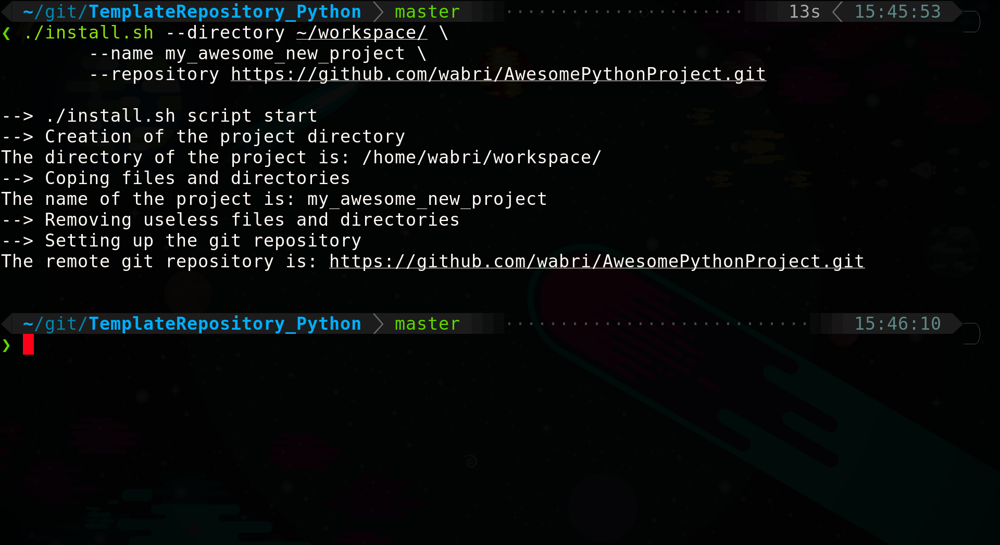
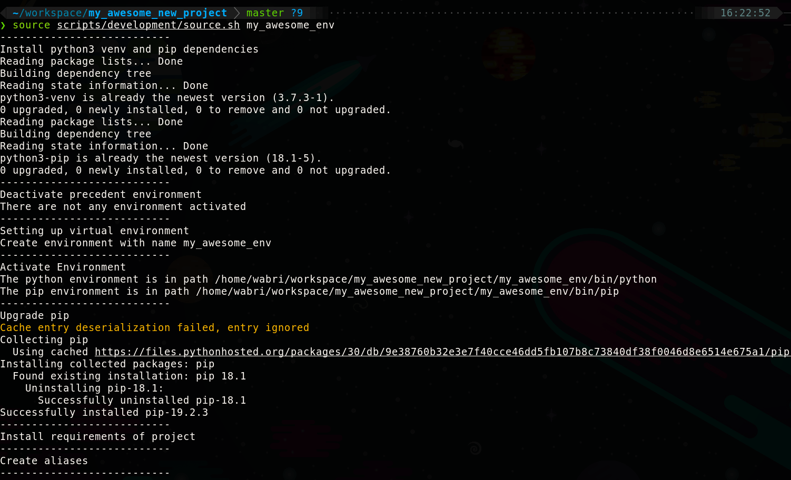
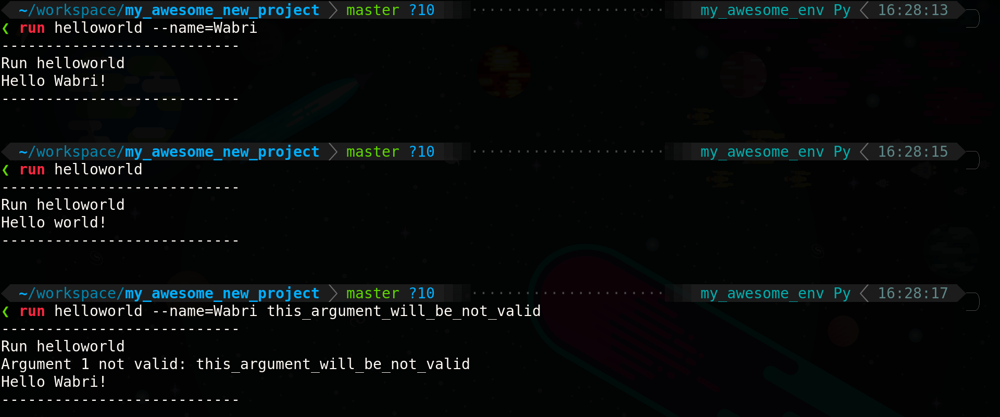

# TemplateRepository_Python
A template for python project across multiple purpose

## Tree structure of project

```Tree
.
├── CHANGELOG.md
├── datas
│   └── helloworld.csv
├── LICENSE
├── packages
│   └── helloworld
│       ├── hello
│       │   ├── __init__.py
│       │   └── output.py
│       ├── requirements.txt
│       ├── run.py
│       └── world
│           ├── __init__.py
│           └── string.py
├── README.md
├── requirements.txt
├── resources
├── scripts
│   └── development
│       ├── README.md
│       ├── source.sh
│       └── tools
│           └── run.sh
└── VERSION
```

**9 directories, 15 files**

## How to set up your project

### Clone it

To use this template you need to clone it with a new name and remove the .git directory:

```Bash
git clone https://github.com/Wabri/TemplateRepository_Python.git <your_name>

cd <your_name>

rm -rf .git
```

### Install.sh

Is also possible to use the install.sh scripts and reuse this template multiple times.
The first thing is to clone the project:

```bash
git clone https://github.com/Wabri/TemplateProject_python.git
```

Then move inside the repository:

```Bash
cd TemplateProject_python
```

And run the install.sh with arguments or none:

```Bash
./install.sh --directory path_to_workspace \
	--name project_name \
	--repository https://github.com/github_name/repository_name.git
```

A simple example is:

```Bash
./install.sh --directory ~/workspace/ \
	--name my_awesome_new_project \
	--repository https://github.com/wabri/AwesomePythonProject.git
```

***TODO: create new screenshot, because new feature added***


## Source with environment

There is inside the [scripts](scripts/development) a directory called development where can be found a [source.sh](scripts/development/source.sh) that can be use to create environment and define some useful alias. The usage is simple:

```Bash
Usage: source ./scripts/development/source.sh [OPTION]'

Mandatory arguments to long options are mandatory for short options too.'

  -h, --help 			Print help page

  -c, --cache           Use virtualenv if exists

  -q, --quiet 			Quiet mode with no output'

  -n, --name NAME 		Specify the name of virtual environment'

  -p, --package NAME 	Specify the name of the package'

```

***TODO: create new screenshot, because new feature added***


This source scripts manage to install all the dependencies for the project and also create the alias:

* run
* requirement

### Run alias

The run alias have multiple pourpose:

1. If the package name was given in argument for the source file, then:

	```Bash
	run [ARGUMENTS]
	```

	Where ARGUMENTS are the arguments of the run.py file of the package given.

2. If the package was not given in argument for the source file, then:

	```Bash
	run PACAKGE_NAME [ARGUMENTS]
	```

	Where:

	* PACKAGE_NAME is the name of the package to run
	* ARGUMENTS are the arguments of the run.py file of the package given


This is the help page:

```
Usage: ./run.sh [OPTION]'

Mandatory arguments to long options are mandatory for short options too.'

  -h, --help 			Print help page'

  -p, --package PATH    Specify the path to the package'

  -m, --main PATH       Specify the path to the main file'
```

The **run.sh** script try to find inside the packages directory for the package name passed, if exists it execute the **run.py** inside of that directory.

***TODO: create new screenshot, because new feature added***


For more infos check out the bash code of [run.sh script](scripts/development/tools/run.sh).

### Requirement alias

The requirement alias works as pip but also update the right requirements.txt:

1. Install package

	```Bash
	requirement --install NAME
	```

	Where NAME is the name of the package you need to install.

2. Uninstall package

	```Bash
	requirement --uninstall NAME
	```

	Where NAME is the name of the package you need to remove.

This is the help page:

```
Usage: ./pip-update-requirements.sh [OPTION]'

Mandatory arguments to long options are mandatory for short options too.'

  -h, --help \t\t\t Print help page'

  -r, --requirements NAME\t Specify the path to the requirements file'

  -u, --uninstall NAME\t\t Specify the package to remove'

  -i, --install NAME\t\t Specify the package to install'
```

## Use on ide

### PyCharm

To use the run.sh script follow this steps:

1. Select the *Run* options
2. *Edit configuration...*
3. *Add New Configuration*
4. In the *Script path* just select the run.sh script inside the development/tools directory
5. Followed by `--package NAME_PACKAGE`
6. If the run.py of the package need more arguments just put before the package argument
7. Give a useful name for this run configuration
8. Done

## Contributions

Every contributions are apprecieted, just create issues or fork and pull requests.
